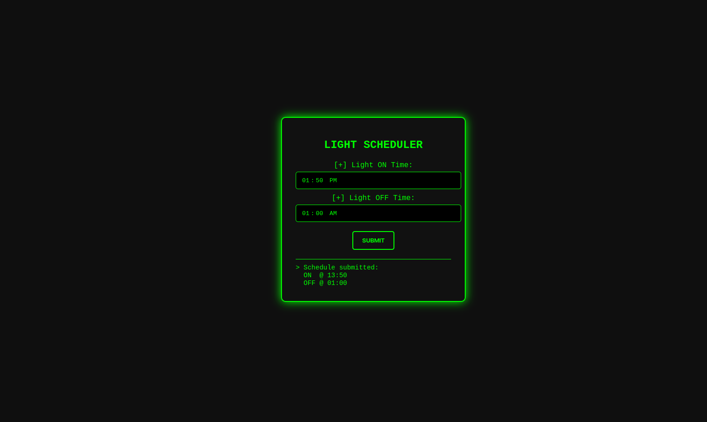
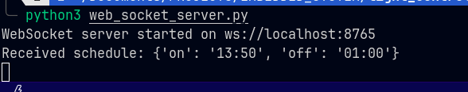

Web-Based Light Scheduler
This project implements a web-based light scheduler using WebSocket and MQTT for the Embedded Systems Software Integration course at Rwanda Coding Academy. The system allows users to schedule a light's ON and OFF times via a web interface, which communicates with an Arduino-controlled relay module through WebSocket and MQTT.
Features

Frontend: HTML/CSS/JS interface for setting ON/OFF times.
WebSocket Server: Python script to receive schedules and publish to MQTT.
MQTT Subscriber: Python script to receive MQTT messages and send commands to Arduino.
Arduino: Controls a relay module based on serial input.

Prerequisites

Python 3.x with libraries: websockets, paho-mqtt, pyserial
Mosquitto (mosquitto_pub, mosquitto_sub)
Arduino UNO with relay module
MQTT broker (provided: 157.173.101.159:1883)

Setup

Clone the repository:git clone https://github.com/Goal651/remote_light_controller.git
cd remote_light_controller

Install Python dependencies:pip install websockets paho-mqtt pyserial

Install Mosquitto (if not already installed):
On Ubuntu: sudo apt-get install mosquitto mosquitto-clients
On Windows/Mac: Follow Mosquitto documentation.

Connect Arduino:
Connect the relay module to Arduino pin 7.
Connect Arduino to the computer via USB (ensure /dev/ttyUSB0 or equivalent is correct).

Upload Arduino code:
Open arduino_relay.ino in Arduino IDE.
Upload to Arduino UNO.

Running the Application

Start the WebSocket server:python websocket_server.py

Start the MQTT subscriber:python mqtt_subscriber.py

Serve the frontend:
Use a local server, e.g., Python’s HTTP server:python -m http.server 8000

Open http://localhost:8000 in a browser.

Use the interface:
Enter ON and OFF times (e.g., 10:50, 11:00).
Click "Submit Schedule".
The light will turn ON/OFF at the specified times via the relay.

File Structure

index.html: Frontend interface.
websocket_server.py: WebSocket server to handle schedules and publish to MQTT.
mqtt_subscriber.py: MQTT subscriber to send commands to Arduino.
arduino_relay.ino: Arduino code to control the relay.
README.md: This file.

Notes

Ensure the MQTT broker (157.173.101.159:1883) is accessible.
Update /dev/ttyUSB0 in Python scripts if your Arduino uses a different port.
The system checks the current time against scheduled times every second.
For demo purposes, schedules are sent as MQTT messages with the format <command> <time> (e.g., 1 10:50).

Screenshots/Demo

Web interface 

WEbsocket server                                                  

Troubleshooting

WebSocket connection fails: Ensure websocket_server.py is running and the browser is accessing ws://localhost:8765.
MQTT connection fails: Verify the broker address and port. Check network connectivity.
Serial errors: Confirm the Arduino port (/dev/ttyUSB0) and ensure no other programs are using it.
Light not switching: Check relay wiring and ensure the Arduino code is uploaded.

Submission

Repository URL: [Insert GitHub URL here]
Submitted via Google Form by April 30, 2025.

Acknowledgments

Rwanda Coding Academy
Instructor: Mr. Gabriel Baziramwabo

